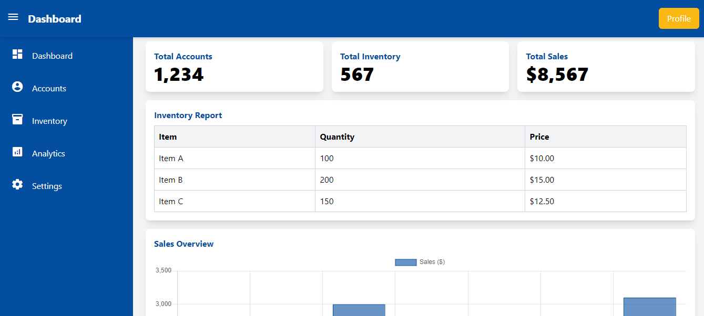
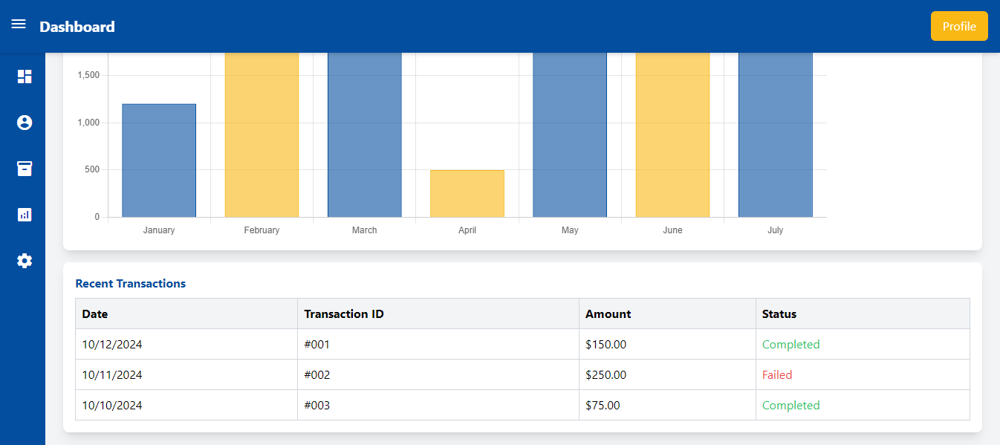

# Tailwind CSS Admin Dashboard

 <!-- Replace with your screenshot path -->

A simple and responsive admin dashboard template built with Tailwind CSS. This dashboard features a collapsible sidebar, a top navigation bar, and various cards for displaying data such as total accounts, inventory, and sales. 

## Table of Contents

- [Features](#features)
- [Installation](#installation)
- [Usage](#usage)
- [Technologies Used](#technologies-used)
- [Contributing](#contributing)
- [License](#license)

## Features

- Responsive design that works on various screen sizes.
- Collapsible sidebar with hover tooltips for better usability.
- Cards for displaying key metrics (total accounts, inventory, sales).
- Easy to customize with Tailwind CSS utility classes.
- User profile section in the top bar.

 

## Installation

To get started with this project, clone the repository and install the required packages:

```bash
git clone https://github.com/thesaidursumon/TailwindSimpleDashboard.git
cd TailwindSimpleDashboard


